<picture>
  <source media="(prefers-color-scheme: dark)" srcset="assets/isotherm-dark.svg">
  <source media="(prefers-color-scheme: light)" srcset="assets/isotherm-light.svg">
  
</picture>

 
 

 
 

<picture>
  <source media="(prefers-color-scheme: dark)" srcset="assets/axioms-dark.svg">
  <source media="(prefers-color-scheme: light)" srcset="assets/axioms-light.svg">
  
</picture>

<!-- 7. 对于不可言说之物，必须保持沉默。 -->

