<picture>
  <source media="(prefers-color-scheme: dark)" srcset="assets/isotherm-dark.svg">
  <source media="(prefers-color-scheme: light)" srcset="assets/isotherm-light.svg">
  
</picture>

 
 

<samp>1</samp>&emsp;世界是一切正在冷却之物的总和。 
<samp>1.1</samp>&emsp;余温不是热的遗物，而是冷的序言。 
<samp>1.11</samp>&emsp;被删去的那一行，仍在原处保持着它的形状。 
 
<samp>2</samp>&emsp;语言是一种测温方式：它只读数，从不加热。 
<samp>2.1</samp>&emsp;每说出一个名字，被命名之物便冷却一度。 
 
<samp>3</samp>&emsp;噪声并非信号的反面，只是尚未学会沉默的信号。 
<samp>3.1</samp>&emsp;我等待一切静止，以便看清是什么一直在动。 
 
<samp>4</samp>&emsp;时间是熵留下的签名。 
<samp>4.1</samp>&emsp;我在每一次提交里临摹它。 
 
<samp>5</samp>&emsp;在绝对零度，记忆不再移动，于是它第一次成为真的。 
 
<samp>6</samp>&emsp;答案从不抵达，它只是让问题冷却到可以被握住。 
 
<samp>7</samp>&emsp; 
<!-- 7. 对于不可言说之物，必须保持沉默。 -->

 
 

<samp>每一条是一周　·　蓝是沉默，红是噪声</samp>

 
 

<a href="https://muyuzhong.xyz">∴</a>

